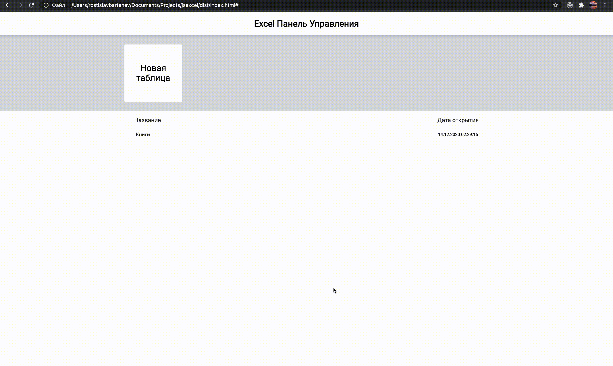

# JS EXCEL

> Проект созданный на чистом JS, повторяющий функционал Google Таблиц.

---

## Описание

#### Что научился делать

- Настраивать автоматизированное
рабочее окружение
- Строить и понимать архитектуру приложения
- Использовать шаблоны проектирования
в своем коде (паттерны)
- Писать код с использованием ООП
- Понимать работу Frontend фреймворков
- Оптимизировать приложения для достижения максимальной производительности
- Разбираться в SOLID принципах
- Понимать, что такое Data Layer и зачем нужны State Managers

---

## Как запустить

#### Установка

    - npm i
   ---

    - npm run build
    - открыть папку dist
    - открыть html

 или

    - npm start

